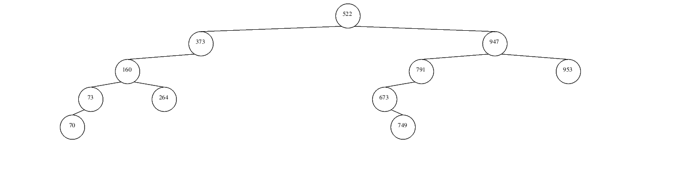
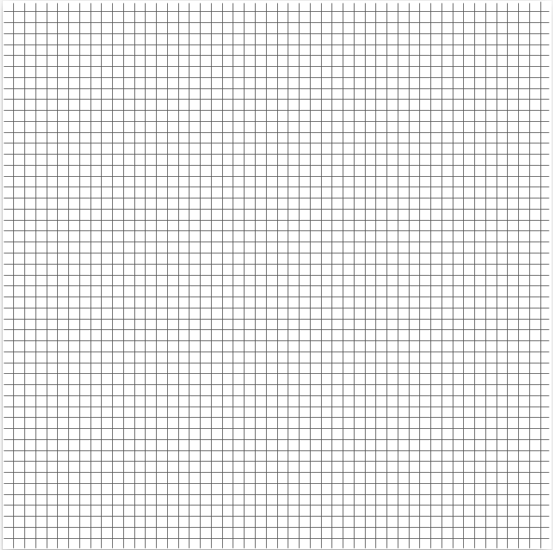
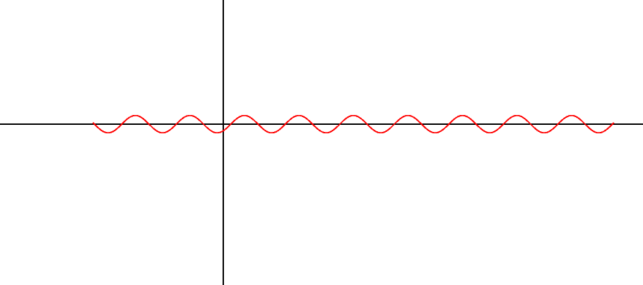
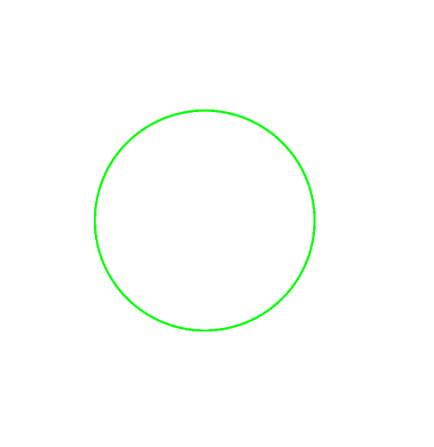
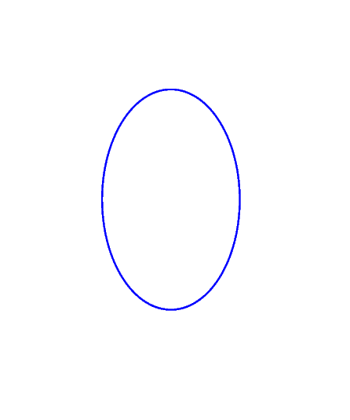

# Vector Graphics with SVG and EPS
Mixture of ```C``` and ```PostScript``` can cause a good geometric shape. It exactly proves that.


___*For more information click the links below :*___
- EPS: See [More Info For EPS][EPS_Link] for a specification of EPS format.

## Project Purpose
- Exporting different figures and structures with given properties in ```C``` by the help of ```PostScript``` as ```eps``` file.

## How it work ?
- Clone the repo , just type ```make``` , it will automatically create figures according to ```Makefile``` content. Different test and scenerios can be set in ```Makefile```.


- 
- 
- 
- 
- 

[EPS_Link]: https://www-cdf.fnal.gov/offline/PostScript/5002.PDF
[SVG_Link]: https://www.w3schools.com/graphics/svg_intro.asp
