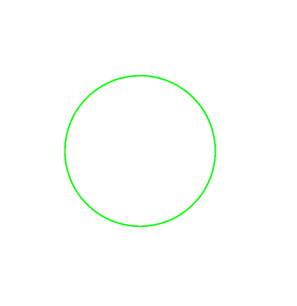
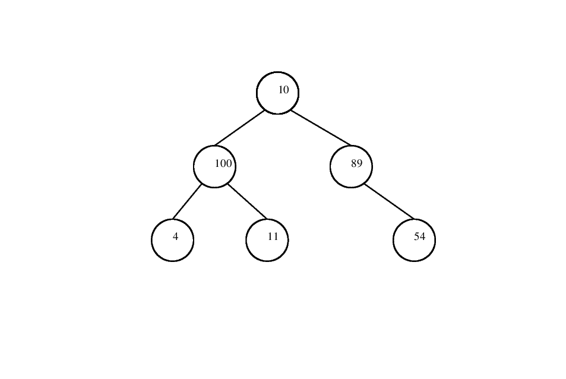
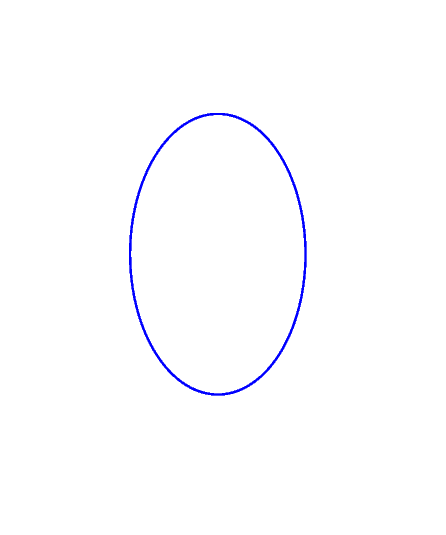

# Vector Graphics with SVG and EPS
Mixture of ```C``` and ```PostScript``` can cause a good geometric shape . It exactly shows that.


___*For more information click the links below :*___
- EPS: See [More Info For EPS][EPS_Link] for a specification of EPS format.
- SVG: See [More Info For SVG][SVG_Link] for an introduction to SVG format.

## Project Purpose
Libraries would be able to draw vector graphics and export EPS or SVG formatted files including your graphics.

**It is just for an educational purpose, there is no guarantee working properly.**

  - Only exporting format is available for this version.


## How it work ?
- Clone the repo , just type ```make``` , it will be automatically create these figures.






[EPS_Link]: https://www-cdf.fnal.gov/offline/PostScript/5002.PDF
[SVG_Link]: https://www.w3schools.com/graphics/svg_intro.asp
